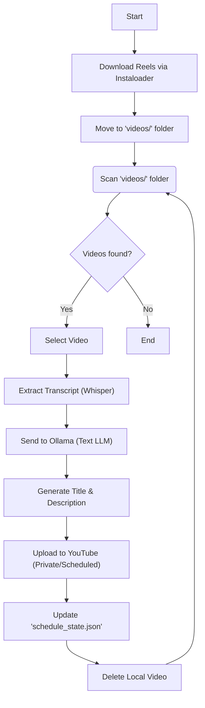

# Reels to Youtube Scheduler

**Automate the pipeline of fetching Instagram Reels and scheduling them as YouTube Shorts.**

This project allows you to bulk download Reels from any public Instagram profile and automatically schedule them for daily uploads on YouTube. It uses a **local AI text model (Ollama)** to read the transcript of each video and generate a catchy, viral title and description before scheduling.

> [!NOTE]
> I do not endorse stealing content, only use this if it's your instagram profile, or if someone gave you permission to run it on their profile.



## Features

- **Instagram Reels Downloader**: Easily fetch all reels from a target profile using `instaloader`.
- **Automatic Scheduling**: Queues one video per day, scheduled for 12:00 PM (noon).
- **AI Metadata Generation**: Uses `faster-whisper` to extract speech and `Ollama` (with `gemma3:1b`) to write a unique title and description based on the transcript.
- **Viral Content**: Uses a tuned system prompt to generate high-retention, "click-baity" titles suitable for Shorts.
- **Set & Forget**: Persistent state tracking ensures the schedule continues smoothly even after restarts.

## Prerequisites

1.  **Python 3.10+**
2.  **Ollama**: Download and install from [ollama.com](https://ollama.com).
    - Pull the text model: `ollama pull gemma3:1b`
3.  **Google Cloud Project**:
    - Enable the "YouTube Data API v3".
    - Create OAuth 2.0 Credentials (Desktop App).
    - Download the JSON file and save it as `client_secrets.json` in the root directory.

## Installation

Install the required Python packages:

```bash
pip install google-api-python-client google-auth-oauthlib google-auth-httplib2 ollama instaloader pytest faster-whisper moviepy
```

## Usage

The workflow consists of three main steps: **Gathering Content**, **Starting AI Service**, and **Scheduling Uploads**.

### Step 1: Download Reels

Use the provided Python script to download reels from an Instagram profile. Or use `batch_download_posts.py` to download specific posts.

All reels from a profile:

```bash
python profile_reels_download.py
```

> [!NOTE]
> The script above may face rate limit issues with Instagram.

Reel(s) by ID:

```bash
python batch_download_posts.py
```

### Step 2: Start Ollama

Start the Ollama server in a separate terminal.

If you don't have `gemma3:1b` yet, make sure to pull it first:

```bash
ollama pull gemma3:1b
```

Then start it:

```bash
ollama serve
```

> [!TIP]
> Use `.\restart_ollama.ps1` to quickly restart the Ollama service if it gets stuck.

### Step 3: Start Scheduler

Once your `videos/` folder is populated and Ollama is running, run the main script:

```bash
python upload_vids.py
```

It will:

1.  Authenticate with YouTube (browser popup on first run).
2.  Process each video in `videos/` sequentially.
3.  Extract transcript using Whisper (CPU-optimized).
4.  Generate AI metadata using Ollama.
5.  Upload the video as "Private" and scheduled for the next available slot.
6.  Delete the local file to save space.

## Deployment

This project includes a fully automated deployment pipeline for Azure using Docker.

- **Infrastructure**: Azure VM running Docker.
- **Automation**: `azure/server_to_cloud.ps1` handles bundling, uploading, and restarting the service.
- **Persistence**: Usage data and video files are persisted on the VM using Docker volumes.

For detailed deployment instructions, credentials setup, and maintenance commands, see [azure/README.md](azure/README.md).

## Development & Testing

For testing purposes without uploading to your real channel:

1.  Place sample videos in `tests/videos_test/`.
2.  Run the tests:

**Run Unit Tests:**

Short tests only:

```bash
pytest
```

Or run all tests (full coverage):

```bash
pytest -s
```

## Project Structure

- `upload_vids.py`: Main scheduler script.
- `profile_reels_download.py`: Script to download all Reels from a profile.
- `batch_download_posts.py`: Script to download specific Reels by ID.
- `restart_ollama.ps1`: Utility to restart Ollama process.
- `videos/`: **Input folder** for production videos (move downloads here).
- `tests/videos_test/`: Input folder for testing.
- `client_secrets.json`: YouTube API credentials.
- `schedule_state.json`: Database of the last scheduled upload date.

## Contributing

Contributions are welcome! Feel free to open an issue or submit a pull request.

## License

This project is licensed under the MIT License - see the [LICENSE](LICENSE) file for details.
