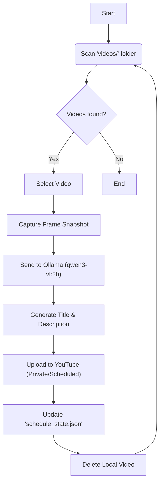

# YouTube Auto-Scheduler

This project automates the daily scheduling of YouTube Shorts. It scans a folder for video files, generates catchy titles and descriptions using a local AI vision model (Ollama), and schedules them to be uploaded to YouTube one by one, continuously incrementing the schedule date.



## Features

- **Automatic Scheduling**: Uploads one video per day, scheduled for 12:00 PM.
- **AI Metadata Generation**: Uses `Ollama` and `qwen3-vl:2b` to watch the video "snapshot" and generate a relevant title and description.
- **Persistent State**: Remembers the last scheduled date so it doesn't overlap uploads, even if restarted.
- **Recursive Processing**: Deletes local files after successful upload to keep the folder clean.

## Prerequisites

1.  **Python 3.10+**
2.  **Ollama**: Download and install from [ollama.com](https://ollama.com).
    - Pull the vision model: `ollama pull qwen3-vl:2b`
3.  **Google Cloud Project**:
    - Enable the "YouTube Data API v3".
    - Create OAuth 2.0 Credentials (Desktop App).
    - Download the JSON file and save it as `client_secrets.json` in the root directory.

## Installation

Install the required Python packages:

```bash
pip install google-api-python-client google-auth-oauthlib google-auth-httplib2 opencv-python ollama pytest
```

## Usage

### 0. Gather Content (Optional)

You can download Instagram Reels from any public profile to use as your source material.

Run the provided PowerShell script:

```powershell
.\profile-reels-downloader.ps1 "instagram_username"
```

_This uses `instaloader` to fetch reels._

> [!IMPORTANT]
> After downloading, move the `.mp4` video files from the downloaded folder into the `videos/` folder so the scheduler can find them.

### 1. Production

Place your `.mp4` or `.mov` files into the `videos/` folder.

Run the script:

```bash
python upload_vids.py
```

It will:

1.  Authenticate with YouTube (browser popup on first run).
2.  Process each video in `videos/`.
3.  Generate metadata via Ollama.
4.  Upload as "Private" scheduled for the next available day.
5.  Delete the local file.

### 2. Development & Testing

For testing, place sample videos in `videos_test/`.

**Run Unit Tests:**

```bash
pytest tests
```

**Run All Tests (including AI inference):**

> [!NOTE]
> The metadata extraction test runs the actual AI model. This takes ~4 minutes on CPU or ~30 seconds on a GPU (RTX 4060+ recommended).

```bash
pytest -s tests/test_metadata_extraction.py
```

_(Use `-s` to enable the interactive prompt confirming you want to run the slow test)_

## GPU Optimization

To make metadata generation significantly faster, ensure Ollama is using your GPU.

1.  Install NVIDIA Drivers.
2.  Run `ollama serve` in a separate terminal to see logs.
3.  If it doesn't detect your GPU (e.g., on a laptop), typically waking the GPU by opening "NVIDIA Control Panel" and restarting Ollama helps.

## Project Structure

- `upload_vids.py`: Main execution script.
- `videos/`: Input folder for production videos.
- `videos_test/`: Input folder for test videos.
- `client_secrets.json`: Your YouTube API credentials (do not commit this!).
- `schedule_state.json`: Tracks the database of the last scheduled upload.
- `tests/`: Contains `pytest` tests.
