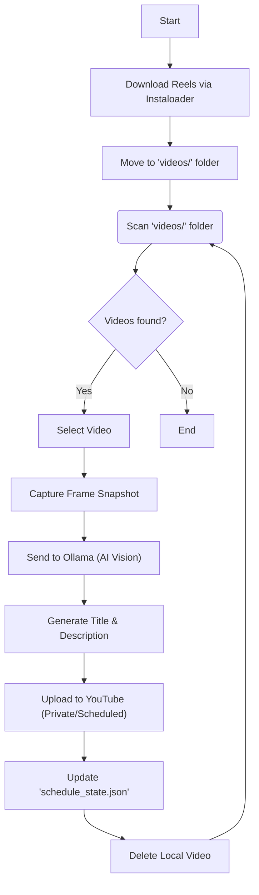

# Reels to Youtube Scheduler

**Automate the pipeline of fetching Instagram Reels and scheduling them as YouTube Shorts.**

This project allows you to bulk download Reels from any public Instagram profile and automatically schedule them for daily uploads on YouTube. It uses a local AI vision model (Ollama) to watch each video and generate a catchy, relevant title and description before scheduling.

> [!NOTE]
> I do not endorse stealing content, only use this if it's your instagram profile.



## Features

- **Instagram Reels Downloader**: Easily fetch all reels from a target profile using `instaloader`.
- **Automatic Scheduling**: Queues one video per day, scheduled for 12:00 PM (noon).
- **AI Metadata Generation**: Uses `Ollama` (with `qwen3-vl:2b` vision model) to analyze the video content and write a unique title and description.
- **Set & Forget**: Persistent state tracking ensures the schedule continues smoothly even after restarts.

## Prerequisites

1.  **Python 3.10+**
2.  **Ollama**: Download and install from [ollama.com](https://ollama.com).
    - Pull the vision model: `ollama pull qwen3-vl:2b`
3.  **Google Cloud Project**:
    - Enable the "YouTube Data API v3".
    - Create OAuth 2.0 Credentials (Desktop App).
    - Download the JSON file and save it as `client_secrets.json` in the root directory.

## Installation

Install the required Python packages (including `instaloader`):

```bash
pip install google-api-python-client google-auth-oauthlib google-auth-httplib2 opencv-python ollama instaloader pytest
```

## Usage

The workflow consists of two main steps: **Gathering Content** and **Scheduling Uploads**.

### Step 1: Download Reels

Use the provided PowerShell script to download reels from an Instagram profile.

```powershell
.\profile-reels-downloader.ps1 "instagram_username"
```

_(This wraps `instaloader` to specifically target reels)._

> [!IMPORTANT]
> The scripts downloads videos into a folder named after the profile. You must **move the `.mp4` files from that folder into the `videos/` folder** for the scheduler to see them.

### Step 2: Start Scheduler

Once your `videos/` folder is populated, run the main script:

```bash
python upload_vids.py
```

It will:

1.  Authenticate with YouTube (browser popup on first run).
2.  Process each video in `videos/` sequentially.
3.  Generate AI metadata.
4.  Upload the video as "Private" and scheduled for the next available slot.
5.  Delete the local file to save space.

## Development & Testing

For testing purposes without uploading to your real channel:

1.  Place sample videos in `videos_test/`.
2.  Run the tests:

**Run Unit Tests:**

```bash
pytest tests
```

**Run Full AI Inference Test:**

> [!NOTE]
> This test runs the actual AI model. Takes ~4 minutes on CPU or ~30 seconds on GPU (RTX 4060+).

```bash
pytest -s tests/test_metadata_extraction.py
```

## GPU Optimization

To speed up metadata generation, ensure Ollama is using your GPU.

1.  Install NVIDIA Drivers.
2.  Run `ollama serve` in a separate terminal to check logs.

## Project Structure

- `upload_vids.py`: Main scheduler script.
- `profile-reels-downloader.ps1`: Helper script to download Instagram Reels.
- `videos/`: **Input folder** for production videos (move downloads here).
- `videos_test/`: Input folder for testing.
- `client_secrets.json`: YouTube API credentials.
- `schedule_state.json`: Database of the last scheduled upload date.
